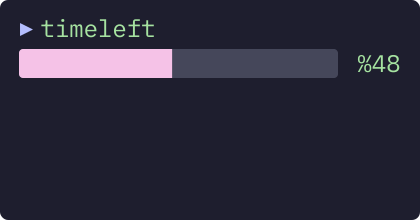

# Time Left [](https://github.com/BetaPictoris/timeleft/actions/workflows/go.yml)

Display the time left of the day as a progress bar.

[](https://github.com/BetaPictoris/timeleft)

## Installation

### From release

```bash
curl -LO https://github.com/BetaPictoris/timeleft/releases/latest/download/timeleft    # Download the latest binary.
sudo install -Dt /usr/local/bin -m 755 timeleft                                        # Install Time Left to "/usr/local/bin" with the mode "755"
```

### Using [Goblin](https://github.com/barelyhuman/goblin)

```bash
curl -sf https://goblin.reaper.im/github.com/BetaPictoris/timeleft/src | OUT=timeleft sh
```

### Build from source

#### Dependencies

You need Go (1.17+) installed to build this program. You can install it from your distro's repository using one of the following commands:

```bash
# Arch/Manjaro (and derivatives)
sudo pacman -Syu go

# Debian/Ubuntu (and derivatives)
sudo apt install golang-go
```

Alternatively, you can install it from [Go's official website](https://go.dev/doc/install).

Then, to build & install wiki run:

```bash
git clone git@github.com:BetaPictoris/timeleft.git      # Clone the repository
cd timeleft                                             # Change into the repository's directory
bash build.sh                                           # Build Time Left
sudo install -Dt /usr/local/bin -m 755 timeleft         # Install Time Left to "/usr/local/bin" with the mode "755"
```

### User install

If you don't have access to `sudo` on your system you can install to your user's `~/.local/bin` directory with this command:

```bash
install -Dt ~/.local/bin -m 755 timeleft
```

---

[](https://github.com/BetaPictoris)
